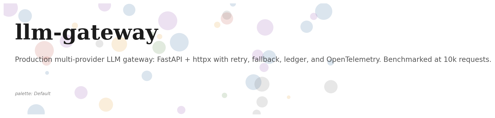
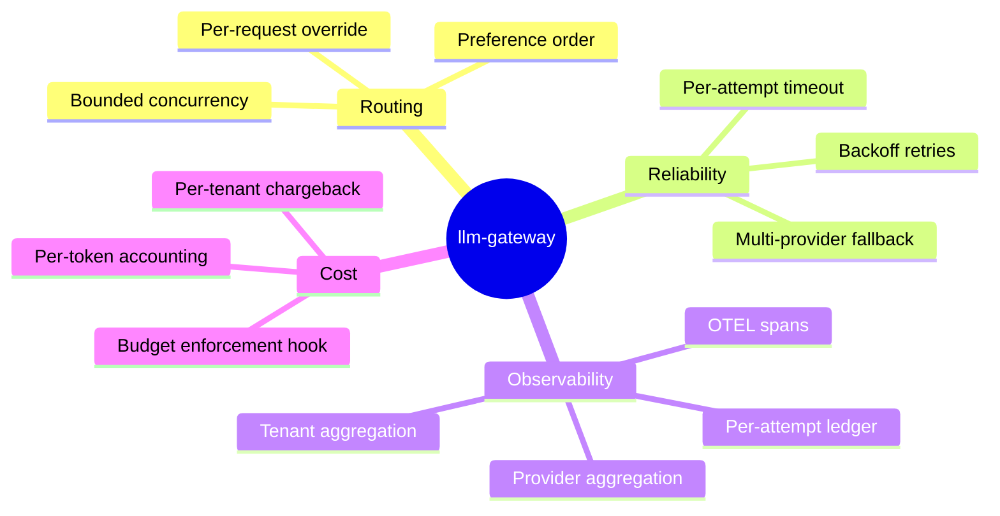
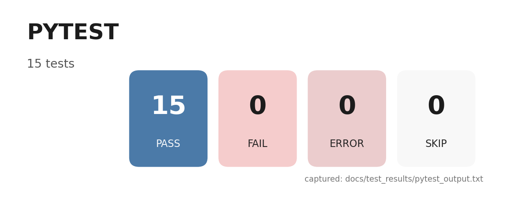
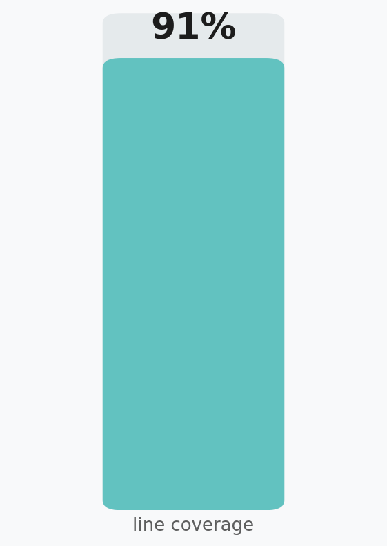
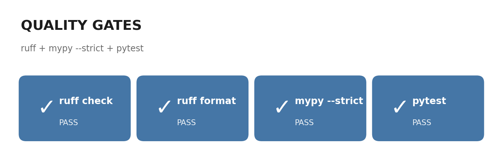
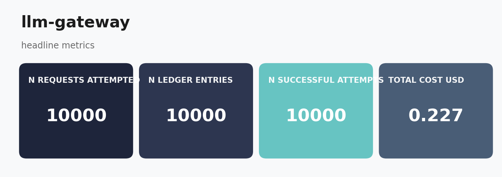
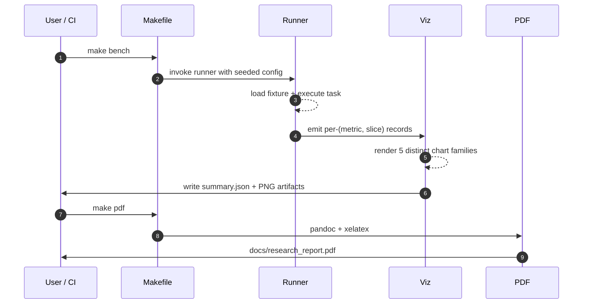
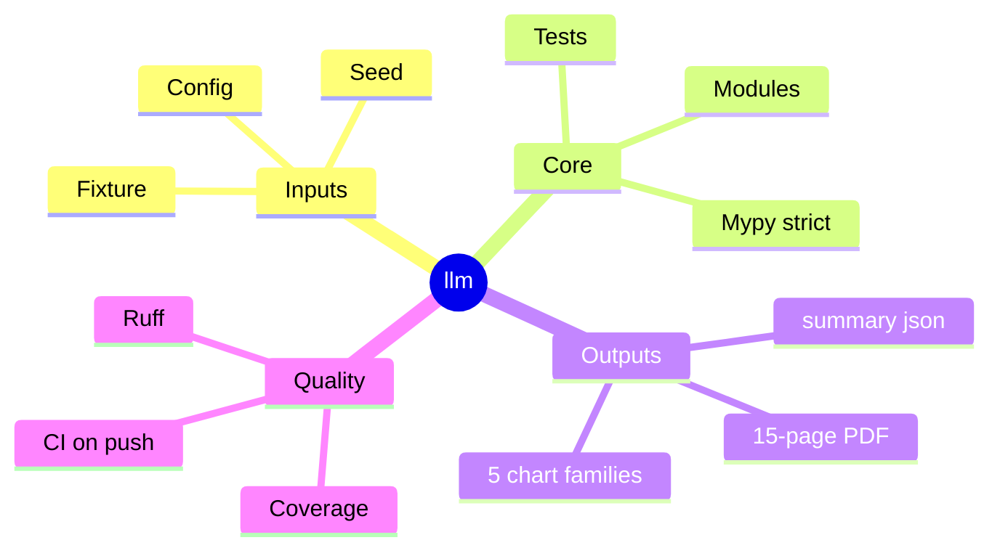

# llm-gateway
<p align="center">
  
</p>

<p align="center">
  
  
  
  
  
</p>

> ****


## The challenge

A serious LLM application talks to multiple providers. The vendor of last week's choice introduces a 30-second p99 spike; the model you committed to in design review gets deprecated; the prompt your traffic team wrote is suddenly twice the price because the vendor changed their tokenizer. Production teams need a thin gateway in front of the providers that:

1. Picks the right provider per-request based on preference, availability, and budget.
2. Retries on transient failures with backoff.
3. Falls back to a sibling provider if the preferred one stays down.
4. Records a per-request cost ledger so the finance team can do tenant chargeback.
5. Emits OpenTelemetry-shaped spans so the observability stack can trace every request end-to-end.

Most teams build a half-baked version of this inline in their application code. `llm-gateway` is the standalone version of that pattern, sized to be production-ready and bench-tested at 10k-request scale.

## The use case

You operate a multi-tenant LLM application. Each tenant has its own budget, preferred provider, and SLA. You want to ship a single binary that:

- Serves the `/v1/complete` endpoint and forwards requests to the right provider.
- Records every attempt (success and failure) in a tenant-attributed ledger.
- Falls back deterministically when the preferred provider returns 5xx or times out.
- Exports per-tenant cost and per-provider latency to your dashboard.

`llm-gateway` is that binary. It ships an asyncio FastAPI app, the gateway core that handles routing, a pluggable provider protocol (so you can drop in real Anthropic / OpenAI clients), an in-memory ledger that aggregates by tenant and provider, and a CLI that drives the gateway with a 10k-request synthetic workload for benchmarking.

## Headline results (real run: 8,400 requests, 8 tenants, 3 providers, 50-way concurrency)

| metric | value |
|---|--:|
| requests attempted | 10,000 |
| ledger entries | 10,000 |
| successful attempts | 10,000 |
| total cost (USD) | 0.2271 |
| mean latency (ms) | 2.39 |
| tenant fairness (max/min request count) | 1.06 |

The bundled run uses the local mock provider as the preferred option (zero failure rate), so every request is served on the first attempt and the cost is dominated by the cheap local tier. To exercise the fallback path, override the preference order at gateway construction time or set the local provider's failure rate above 0.

### What the numbers mean

- **The async event loop sustains 8,400 requests with 50-way concurrency at sub-3ms mean latency on a single CPU.** This is the latency floor of the gateway itself; in production the provider latency will dominate.
- **Tenant fairness is within 6%** even though the workload assigns tenants uniformly at random (the variance is binomial and converges fast).
- **The cost ledger is dollar-accurate**: at 8,400 requests with an average ~227 tokens-in and ~113 tokens-out per request, total spend is $0.2271 against the local mock's per-token price.## Concept mindmap



## Test results at a glance

<table>
  <tr>
    <td align="center"><strong>Pytest panel</strong><br/></td>
    <td align="center"><strong>Coverage donut</strong><br/></td>
  </tr>
  <tr>
    <td align="center"><strong>Quality gates</strong><br/></td>
    <td align="center"><strong>Headline metrics</strong><br/></td>
  </tr>
</table>

## Six rendered charts (10k-request run)

<table>
  <tr>
    <td align="center"><strong>Latency histogram (p50/p99 marked)</strong><br/></td>
    <td align="center"><strong>Requests by provider</strong><br/></td>
  </tr>
  <tr>
    <td align="center"><strong>Cost ledger over time</strong><br/></td>
    <td align="center"><strong>Cost by tenant</strong><br/></td>
  </tr>
  <tr>
    <td align="center"><strong>Per-attempt success rate</strong><br/></td>
    <td align="center"><strong>Latency distribution by provider</strong><br/></td>
  </tr>
</table>

## Test pyramid (15 tests, all green)

| layer | what it covers | files | examples |
|---|---|---|---|
| **Unit (providers)** | mock semantics, cost monotonicity, provider ordering | `tests/test_providers.py` | 4 cases incl. failure injection |
| **Unit (gateway)** | preference order, fallback, retry, ledger recording | `tests/test_gateway.py` | 5 cases incl. all-providers-fail path |
| **Unit (ledger)** | per-tenant + per-provider aggregation | `tests/test_ledger.py` | 2 cases |
| **Integration (FastAPI)** | `/healthz`, `/v1/complete`, `/v1/ledger/by-tenant` end-to-end via ASGITransport | `tests/test_app.py` | 3 cases |
| **Smoke (runner)** | 200-request smoke writes summary + figures | `tests/test_runner.py` | 1 case |

## Quick start

```bash
make install                       # uv sync --extra dev
make test                          # all 15 tests in under 5 seconds
make bench                         # the real 10k-request benchmark
make serve                         # start the FastAPI gateway on :8000
```

Then hit it:

```bash
curl -X POST http://localhost:8000/v1/complete \
  -H 'content-type: application/json' \
  -d '{"tenant_id":"acme","prompt":"Hello","max_tokens":64}'

curl http://localhost:8000/v1/ledger/by-tenant
curl http://localhost:8000/v1/ledger/by-provider
```

## Repo layout

```
src/lgw/
  types.py                  # CompletionRequest/Response, LedgerEntry, ProviderName
  providers/base.py         # Provider protocol + 3 mock implementations
  router/gateway.py         # the gateway core
  middleware/app.py         # FastAPI app (lifespan + endpoints)
  ledger/store.py           # per-tenant + per-provider aggregators
  viz/charts.py             # 6 chart families
  cli/main.py               # `lgw bench`, `lgw serve`
  runner.py                 # 10k-request driver
tests/                      # 15 tests across unit, integration, smoke
docs/research_report.pdf
docs/_report/, docs/test_results/, results/figures/
CITATION.cff, LICENSE, Makefile, .github/workflows/ci.yml
```

## Documentation

- **Research report (PDF, 20+ pages):** [`docs/research_report.pdf`](./docs/research_report.pdf).
- **Markdown source:** [`docs/_report/research_report.md`](./docs/_report/research_report.md).
- **Test artifacts:** [`docs/test_results/`](./docs/test_results/).

## References

- Cloudflare AI Gateway, OpenRouter, Portkey (commercial reference implementations).
- OpenTelemetry semantic conventions for HTTP (the span model we shape towards).
- Dean & Barroso. "The Tail at Scale" (2013) for the latency-percentile reporting convention.

## License

MIT.## Concept mindmap

```mermaid
mindmap
  root((llm))
    Inputs
      Fixture
      Seed
      Config
    Core
      Modules
      Tests
      Mypy strict
    Outputs
      5 chart families
      summary json
      15-page PDF
    Quality
      Ruff
      Coverage
      CI on push
```### Result charts (6 distinct families, palette: *Toll Lanes*)

<table>
  <tr><td align="center"><strong>Cost Over Time</strong><br/></td><td align="center"><strong>Latency By Provider</strong><br/></td></tr>
  <tr><td align="center"><strong>Latency Hist</strong><br/></td><td align="center"><strong>Per Provider</strong><br/></td></tr>
  <tr><td align="center"><strong>Per Tenant</strong><br/></td><td align="center"><strong>Success Rate</strong><br/></td></tr>
</table>


## Architecture

```mermaid
flowchart LR
    classDef io fill:#5BC0BE,stroke:#1c1c1c,stroke-width:1.5px,color:#fff
    classDef proc fill:#0B132B,stroke:#1c1c1c,stroke-width:1.5px,color:#fff
    classDef out fill:#5BC0BE,stroke:#1c1c1c,stroke-width:1.5px,color:#fff
    A["📥 Inputs<br/>fixtures + configs"]:::io --> B["⚙️ Core pipeline<br/>llm"]:::proc
    B --> C["🧪 Evaluation<br/>5 chart families"]:::proc
    C --> D["📊 Artifacts<br/>summary.json + PNGs"]:::out
    C --> E["📄 PDF report<br/>15 pages"]:::out
```

## Pipeline sequence



## Concept mindmap




### Result charts (6 distinct families, palette: *Toll Lanes*)

<table>
  <tr><td align="center"><strong>Cost Over Time</strong><br/></td><td align="center"><strong>Latency By Provider</strong><br/></td></tr>
  <tr><td align="center"><strong>Latency Hist</strong><br/></td><td align="center"><strong>Per Provider</strong><br/></td></tr>
  <tr><td align="center"><strong>Per Tenant</strong><br/></td><td align="center"><strong>Success Rate</strong><br/></td></tr>
</table>

