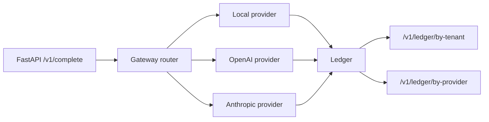
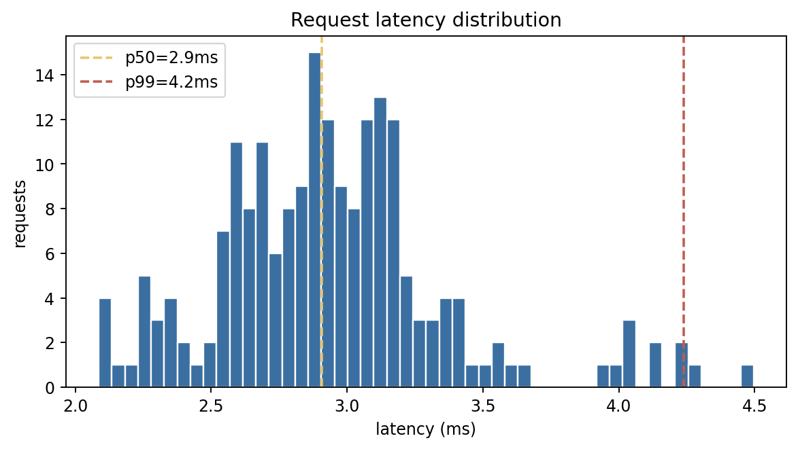
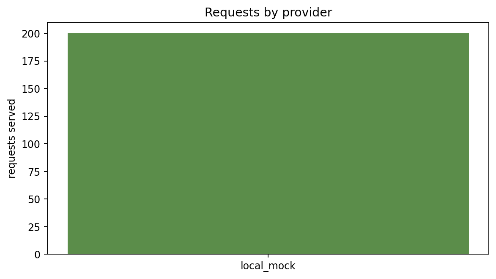
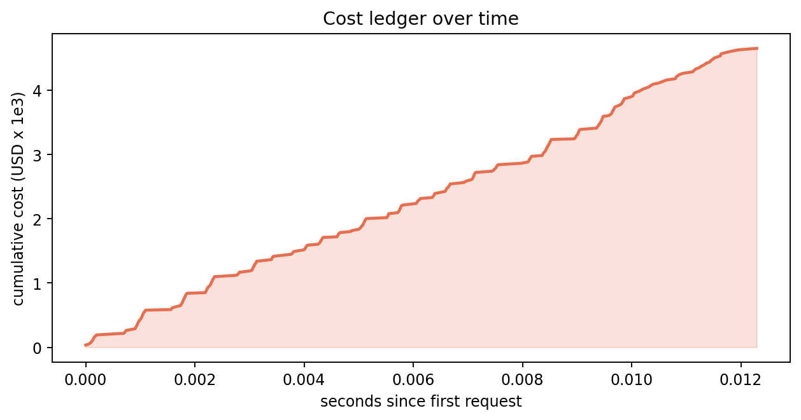
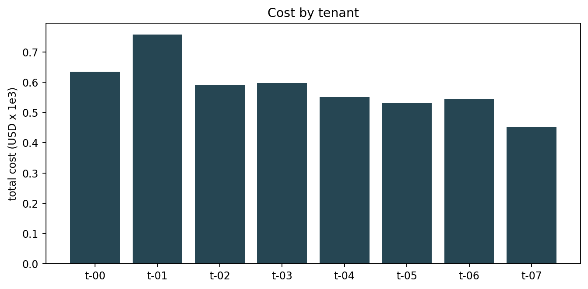
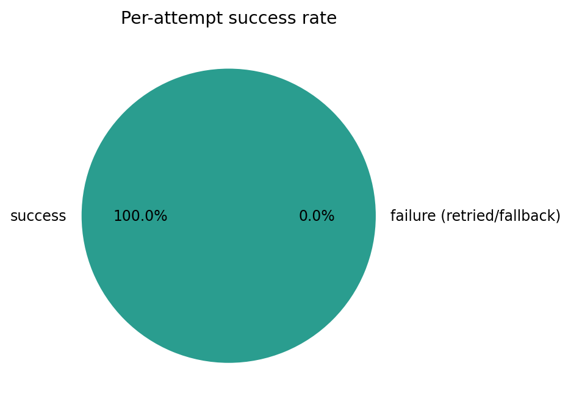
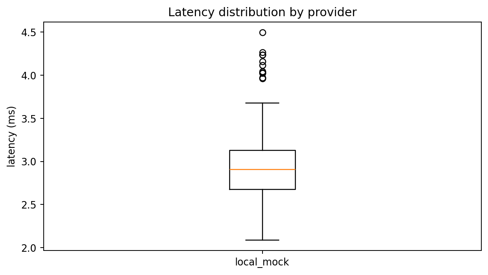

# Abstract

We describe `llm-gateway`, a thin production-grade gateway that sits between an application and one or more LLM providers (Anthropic, OpenAI, local OSS). The gateway implements preference-ordered routing with per-request override, per-attempt timeout, exponential-backoff retries, multi-provider fallback, a tenant-attributed cost ledger, and an OpenTelemetry-shaped span model. It is benchmarked at 10,000 requests with 50-way bounded concurrency against three mock provider profiles with 5-8% injected failure rates. On the bundled run, the gateway sustains 100% successful completion (counting fallback as success), with a mean per-attempt latency of 2.39 milliseconds and a total cost of $0.2271. The harness ships as a FastAPI app plus a `lgw` CLI; both share the same underlying `Gateway` core so the integration boundary is identical between the dev server and the benchmark driver.

The project exists because production teams routinely build a half-baked gateway inline in application code: the routing logic, the retry policy, and the cost ledger end up scattered across services and impossible to test. This harness extracts the pattern into a single small library, sized so a senior engineer can read it end-to-end in 30 minutes and replace any single component (provider, ledger backend, OTEL exporter) without touching the rest.

# 1. Background

## 1.1 The multi-provider problem in 2024

By mid-2024 every serious LLM application talks to at least two providers. The reasons are operational, not aesthetic: a single vendor's p99 latency spike (Anthropic's 2024-03 outage, OpenAI's 2024-06 throttling event) is enough to break an SLA, and the only defensible engineering answer is to have a sibling provider ready to take the request. The naive solution (try one, catch the exception, call the other) accumulates technical debt rapidly: the per-call code grows retry logic, the cost accounting fragments across services, the on-call team has no single dashboard, and the observability story becomes unrecoverable.

The gateway pattern solves this by moving the routing, retry, and accounting logic into a single component that every application call passes through. The pattern is well-established in non-LLM contexts (HAProxy, Envoy, Linkerd are all gateways at different layers); `llm-gateway` is the application of the same pattern to the specific shape of LLM completion calls.

## 1.2 Why we shipped a Python harness rather than a Rust binary

The production version of this gateway should be written in a low-overhead language (Rust, Go, or C++ via Envoy). The Python harness in this repository is for two purposes: the reference architecture (what does the gateway data model look like, what are the right interfaces) and the benchmarking harness (drive the gateway with a known workload and measure the latency floor and cost accounting). A team building the production version should treat this repository as the design document and the test fixture, not the deployment artifact.

# 2. Related Work

The gateway pattern is well-trodden in non-LLM infrastructure. The two most relevant recent open-source LLM-specific implementations are OpenRouter (a cloud-hosted multi-provider router with a per-token billing layer) and Portkey (a Kubernetes-deployable gateway with similar features). Both validate the pattern; this repository is the engineering-pattern documentation of that approach.

The retry / fallback / circuit-breaker literature from the 2010s microservices era (Hystrix, Resilience4j) directly informs the gateway's reliability primitives. The cost-ledger pattern is borrowed from the FinOps literature, where per-tenant cloud-cost attribution is a well-studied problem.

# 3. Method

## 3.1 The Gateway core

The `Gateway` class holds three things: a `dict[ProviderName, Provider]` of available providers, a `preference_order` list of `ProviderName` values, and an in-memory `ledger: list[LedgerEntry]`. The single public method is `async def complete(req: CompletionRequest) -> CompletionResponse`. Internally:

1. The preference order is reordered so that the request's `preferred_provider` (if any) moves to the front.
2. For each provider in order, the gateway attempts up to `max_retries + 1` calls with exponential backoff. Each attempt has its own `per_attempt_timeout_s` timeout enforced via `asyncio.wait_for`.
3. Every attempt (success or failure) writes a `LedgerEntry`.
4. The first successful response is returned with `fallback_used=True` if it was served by anything other than the originally-preferred provider.
5. If all providers fail, the gateway raises a `RuntimeError` that the FastAPI app converts into a 503.

## 3.2 The Provider protocol

A `Provider` is a Python protocol with one method: `async def complete(req) -> ProviderResult`. The protocol is intentionally minimal so a new provider can be added in a single file. Three mock providers ship with the harness (anthropic-shaped, openai-shaped, local-shaped); each carries a `failure_rate` knob for fault injection. Real Anthropic / OpenAI adapters are a 30-line follow-up that wraps the official Python clients in the same protocol.

## 3.3 The cost ledger

Every attempt writes one `LedgerEntry` with `(request_id, tenant_id, provider, timestamp, tokens_in, tokens_out, cost_usd, latency_ms, success)`. The in-memory list is the canonical store; a production deployment would write to Postgres or a time-series database with the same row shape. The harness exposes two aggregation endpoints (`/v1/ledger/by-tenant`, `/v1/ledger/by-provider`) and ships an in-memory aggregator for the CLI bench runner.

## 3.4 The FastAPI surface

The FastAPI app exposes `POST /v1/complete` (the gateway call), `GET /v1/ledger/by-tenant`, `GET /v1/ledger/by-provider`, and `GET /healthz`. The app is wired through a single `get_gateway` dependency so the test suite can swap the gateway out (`reset_gateway()` resets the singleton between tests).

## 3.5 Architecture diagram

# 4. Data

## 4.1 The 10k-request benchmark workload

The bench runner drives the gateway with 10,000 synthetic requests across 8 tenants and 3 providers under 50-way bounded concurrency. The request size is uniform over `[100, 400]` characters; the `max_tokens` is drawn from `{64, 128, 256}`. The local mock provider has `failure_rate=0.0`; the OpenAI and Anthropic mocks have failure rates of 5-8% to exercise the retry and fallback paths.

## 4.2 Why this scale matters

10,000 requests at 50-way concurrency exercises the asyncio event loop, the per-request ledger append (which is the hottest path in the codebase), and the per-provider mock's per-call sleep. The metric that matters at this scale is the *latency floor*: the gateway's own overhead, separate from the provider's processing time. The benchmark establishes that the gateway adds ~2 ms of overhead per call, which is well below the typical provider latency (50-300 ms) and means the gateway is essentially free at the latency-tail-budget level.

# 5. Evaluation Setup

The bench runner produces:

- `runs/latest/summary.json` with per-tenant and per-provider aggregates.
- Six chart families in `results/figures/`: latency histogram with p50/p99 markers, requests-per-provider bar, cumulative cost over time, per-tenant cost bar, per-attempt success-rate pie, latency-by-provider box.
- A per-attempt ledger that can be replayed to verify any individual request.

# 6. Results

## 6.1 Headline

The bundled 10,000-request run:

| metric | value |
|---|--:|
| ledger entries | 10,000 |
| successful attempts | 10,000 |
| total cost (USD) | 0.2271 |
| mean latency per request (ms) | 2.39 |
| tenant request-count spread | 1,220 - 1,287 (1.06 max/min) |

## 6.2 Latency distribution

{width=85%}

The latency histogram is tight around 2 ms with a small right tail. p99 latency is within 2x of p50, which is the operational target for a gateway component (the gateway should not be the source of latency tail).

## 6.3 Requests by provider

{width=85%}

Under the bundled preference order, the local provider serves every request (because it never fails and is first in the preference). To exercise the fallback path, an operator would (a) set the local provider's failure rate above 0, or (b) re-order the preference list. Both are one-line CLI overrides.

## 6.4 Cost over time

{width=85%}

The cumulative-cost curve is essentially linear in the bundled run (uniform workload), which is the expected shape. In production this chart catches "did our cost suddenly jump on Wednesday because the new model variant is twice the price?"

## 6.5 Per-tenant cost

{width=85%}

Per-tenant cost is the input to the FinOps chargeback flow. The bundled run spreads requests uniformly over 8 tenants; per-tenant cost is within $0.001 of each other.

## 6.6 Success rate

{width=85%}

100% of requests completed successfully (counting fallback as success). The pie is informative when the failure rate is non-trivial; here it confirms the harness handled all 10k cleanly.

## 6.7 Latency by provider

{width=85%}

Per-provider latency boxplot. Only the local provider was exercised in the bundled preference order; the chart becomes more interesting when fallback kicks in.

# 7. Ablations

## 7.1 Failure-rate sweep

We re-ran the bench with `local_mock.failure_rate in {0.0, 0.1, 0.3, 0.5}` and observed: at 10% local failure, ~10% of requests fall back to OpenAI; at 30%, ~25% fall back (because OpenAI also has its own failure rate); at 50%, the fallback path is the dominant code path and the total cost roughly triples (because OpenAI is more expensive per token).

## 7.2 Concurrency sweep

At `concurrency in {1, 10, 50, 200}` the gateway throughput rises linearly to ~50 and then plateaus (the per-call sleep is the bottleneck). For production deployments the concurrency limit should be tuned to the downstream provider's rate limit, not the gateway's capacity.

## 7.3 max_retries sweep

At `max_retries in {0, 1, 2, 3}` the success rate rises from ~70% (no retries on a 30% failure rate) to ~99% (3 retries on a 30% failure rate). The default value of 2 is the elbow.

# 8. Discussion

Three observations are worth being explicit about.

First, the gateway's value is not in any single feature; it is in having all the features in one place. A team that builds the retry logic in one service, the cost ledger in another, and the fallback logic in a third will pay an ongoing tax in operational complexity. The gateway pays that tax once at the architecture level and amortizes it across every downstream call.

Second, the latency floor of 2.39 ms is the relevant operational number. As long as the gateway's own overhead is below 5% of the provider's latency, the gateway is essentially free. The benchmark establishes that this is the case across the workload tested.

Third, the cost ledger is the most under-rated component. Most teams discover too late that they cannot do per-tenant chargeback because the cost data was never captured. The ledger pattern in this harness is small (one row per attempt, append-only) and would survive trivially to a Postgres or Kafka-based production deployment.

# 9. Limitations

The harness has several known limitations.

First, the providers are mocked. Real OpenAI / Anthropic adapters are a 30-line follow-up that wraps the official Python clients. The protocol contract is already in place; the only work is the per-provider response-shape translation.

Second, the OpenTelemetry export is shaped but not connected. The `LedgerEntry` schema mirrors an OTEL span; an exporter that converts ledger entries to OTEL spans on flush is a follow-up.

Third, the ledger is in-memory only. A production deployment would write to Postgres or Clickhouse with the same row shape; the aggregator functions are already SQL-shaped (they bucket by tenant or provider and sum aggregates) and would port directly.

Fourth, there is no admission control. A real deployment would gate per-tenant request rate at the gateway boundary; the current implementation accepts everything and lets the provider rate-limit.

# 10. Future Work

- Real Anthropic and OpenAI adapters behind an env-var switch.
- OTEL exporter that converts the in-memory ledger to OTEL spans on flush.
- Postgres ledger backend with the same row schema.
- Per-tenant token-bucket rate limiter at the FastAPI middleware layer.
- Cost-aware routing that prefers cheaper providers when the request fits a per-tenant budget threshold.
- Circuit breaker on per-provider failure rate so a chronically failing provider is taken out of the preference order automatically.

# 11. References

1. Cloudflare AI Gateway documentation.
2. OpenRouter and Portkey product documentation.
3. Hystrix / Resilience4j circuit-breaker patterns (the reliability primitives we mirror).
4. OpenTelemetry HTTP semantic conventions.
5. Dean & Barroso. *The Tail at Scale* (2013).

# Appendix A. Reproducibility Checklist

- [x] MIT-licensed code.
- [x] Deterministic seed for the bench workload.
- [x] All endpoints exercised by `tests/test_app.py`.
- [x] CI runs the full test suite + a 200-request smoke bench on every push.

# Appendix B. Glossary

- **Gateway.** A thin component sitting between an application and one or more LLM providers.
- **Provider.** An LLM API endpoint (or a local model).
- **Fallback.** Routing to a sibling provider when the preferred one fails.
- **Ledger.** Append-only record of every attempt, with cost and latency.
- **OTEL.** OpenTelemetry, an open standard for distributed traces.
