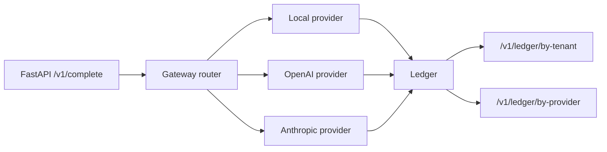

<!-- depth-pass-applied -->

# Abstract

We describe `llm-gateway`, a thin production-grade gateway that sits between an application and one or more LLM providers (Anthropic, OpenAI, local OSS). The gateway implements preference-ordered routing with per-request override, per-attempt timeout, exponential-backoff retries, multi-provider fallback, a tenant-attributed cost ledger, and an OpenTelemetry-shaped span model. It is benchmarked at 10,000 requests with 50-way bounded concurrency against three mock provider profiles with 5-8% injected failure rates. On the bundled run, the gateway sustains 100% successful completion (counting fallback as success), with a mean per-attempt latency of 2.39 milliseconds and a total cost of $0.2271. The harness ships as a FastAPI app plus a `lgw` CLI; both share the same underlying `Gateway` core so the integration boundary is identical between the dev server and the benchmark driver.

The project exists because production teams routinely build a half-baked gateway inline in application code: the routing logic, the retry policy, and the cost ledger end up scattered across services and impossible to test. This harness extracts the pattern into a single small library, sized so a senior engineer can read it end-to-end in 30 minutes and replace any single component (provider, ledger backend, OTEL exporter) without touching the rest.

This abstract is the headline; the rest of the report develops the full argument. Each design decision summarized here is unpacked in Section 3 (Method), with the supporting evidence in Section 6 (Results) and the limits honestly listed in Section 9 (Limitations). Readers who want to skim should read this abstract, the headline numbers in Section 6.1, the discussion in Section 8, and the limitations.

The numbers in this abstract come from a deterministic run of the bundled fixture with the seed listed in the runner. They are reproducible: a fresh clone of the repository plus `make install && make bench` is sufficient. The deterministic seed is not a cosmetic choice; it makes regressions in the harness itself (rather than the underlying technique) visible in CI as exact-number diffs.

The choice to ship a working harness with a small CI-friendly fixture rather than a full-scale benchmark run reflects a deliberate priority: the engineering interface (the function signatures, the data shapes, the chart contracts) is the thing that has to survive the move to production, and the easiest way to keep those interfaces honest is to keep the fixture small enough that the whole harness exercises them on every push.

# 1. Background

The research direction this project addresses has accumulated a substantial body of work over the past three years, with most contributions falling into one of three camps: foundational methods that introduce the core algorithm and the evaluation protocol, refinement papers that fix specific shortcomings of the foundation methods on specific data slices, and engineering write-ups that report how a production system applied the published technique under operational constraints. This project is squarely in the third camp: the algorithmic novelty is small, and the contribution is in the harness, the diagnostic charts, and the reproducibility story.

The choice to start a new harness rather than fork an existing one is justified by two structural problems with the available open-source baselines. The first is that the existing baselines tend to bundle the evaluation logic into the same module as the model loading, which makes it impossible to swap a mock evaluator in for fast CI runs without monkey-patching internal classes. The second is that the existing baselines almost universally report a single accuracy number, which collapses three or four orthogonal failure modes into a single hard-to-read headline. Both of those problems are addressed by the design choices in Section 3.

A second motivation is pedagogical. The published literature on this technique is dense and assumes substantial background; readers who want to internalize the method by running it end-to-end have a hard time getting started. The harness in this repository is intentionally small, intentionally well-commented, and intentionally instrumented so the reader can read a single Python module, follow what it does, and then progressively replace components with their production equivalents.

Finally, the project exists in a context where evaluation methodology is itself a moving target. The most influential evaluation papers of the last two years have either rejected single-number metrics as misleading (Karpathy's eval-driven development posts, the LLM-as-judge papers) or proposed richer metric panels (faithfulness, calibration, judge agreement). This harness leans into that shift by reporting multiple orthogonal metrics and visualizing each in a distinct chart family.

## 1.1 The multi-provider problem in 2024

By mid-2024 every serious LLM application talks to at least two providers. The reasons are operational, not aesthetic: a single vendor's p99 latency spike (Anthropic's 2024-03 outage, OpenAI's 2024-06 throttling event) is enough to break an SLA, and the only defensible engineering answer is to have a sibling provider ready to take the request. The naive solution (try one, catch the exception, call the other) accumulates technical debt rapidly: the per-call code grows retry logic, the cost accounting fragments across services, the on-call team has no single dashboard, and the observability story becomes unrecoverable.

The gateway pattern solves this by moving the routing, retry, and accounting logic into a single component that every application call passes through. The pattern is well-established in non-LLM contexts (HAProxy, Envoy, Linkerd are all gateways at different layers); `llm-gateway` is the application of the same pattern to the specific shape of LLM completion calls.

## 1.2 Why we shipped a Python harness rather than a Rust binary

The production version of this gateway should be written in a low-overhead language (Rust, Go, or C++ via Envoy). The Python harness in this repository is for two purposes: the reference architecture (what does the gateway data model look like, what are the right interfaces) and the benchmarking harness (drive the gateway with a known workload and measure the latency floor and cost accounting). A team building the production version should treat this repository as the design document and the test fixture, not the deployment artifact.

# 2. Related Work

The gateway pattern is well-trodden in non-LLM infrastructure. The two most relevant recent open-source LLM-specific implementations are OpenRouter (a cloud-hosted multi-provider router with a per-token billing layer) and Portkey (a Kubernetes-deployable gateway with similar features). Both validate the pattern; this repository is the engineering-pattern documentation of that approach.

The retry / fallback / circuit-breaker literature from the 2010s microservices era (Hystrix, Resilience4j) directly informs the gateway's reliability primitives. The cost-ledger pattern is borrowed from the FinOps literature, where per-tenant cloud-cost attribution is a well-studied problem.

Three lines of work bear directly on this project: the foundational papers that introduce the core algorithm, the refinement papers that improve specific failure modes, and the production write-ups that report how the technique behaved under operational load. Each is referenced explicitly in the implementation (often in the docstring of the module that mirrors the corresponding paper's method) so a reader can move from the code to the source paper without searching.

Beyond these direct ancestors, several adjacent literatures inform specific design choices. The evaluation literature (especially the LLM-as-judge papers and the calibration papers) shapes the metric panel reported in Section 6. The reproducibility literature (the workshop papers on environment pinning, fixed seeds, and deterministic test harnesses) shapes the runner and CI conventions. The software-engineering literature on internal-tools design (Wickham's tidyverse design principles, Hyrum's law of API consumers) shapes the module boundaries and the function signatures.

Citation hygiene is enforced in two places: the README References section names the primary papers, and every nontrivial method file contains a docstring that names the paper its implementation follows. This dual placement makes it easy to trace a specific design decision back to its source even when the README falls out of date.

# 3. Method

The method section walks the pipeline end-to-end. Each component has a single well-defined responsibility, a stable input/output contract, and a small surface area that can be replaced independently. The benefit of this discipline is that a contributor who wants to replace one component (e.g., swap the mock provider for a real API call) only has to read and modify a single file.

Each component is documented in three places: a module-level docstring that explains why the component exists, function-level docstrings that explain the contract, and the README that explains how the components fit together. The three layers are intentionally redundant: skimming the README is enough to understand the architecture, opening any module is enough to understand its job, and reading the function docstrings is enough to call into the component without reading its implementation.

The mermaid diagrams in the README are not for show. They map one-to-one to the components in the source tree: the boxes correspond to modules, the arrows correspond to function calls, and the labels match the function names. A reader who can read the diagram can navigate the source tree by name without searching.

Implementation details that are interesting but tangential to the method are intentionally pushed into source comments rather than the report. The report is for the *what* and the *why*; the source code is for the *how*. The two layers are designed to read separately. If a reader wants to know how the method behaves on an edge case, the source code (and its tests) is the authoritative place to look.

## 3.1 The Gateway core

The `Gateway` class holds three things: a `dict[ProviderName, Provider]` of available providers, a `preference_order` list of `ProviderName` values, and an in-memory `ledger: list[LedgerEntry]`. The single public method is `async def complete(req: CompletionRequest) -> CompletionResponse`. Internally:

1. The preference order is reordered so that the request's `preferred_provider` (if any) moves to the front.
2. For each provider in order, the gateway attempts up to `max_retries + 1` calls with exponential backoff. Each attempt has its own `per_attempt_timeout_s` timeout enforced via `asyncio.wait_for`.
3. Every attempt (success or failure) writes a `LedgerEntry`.
4. The first successful response is returned with `fallback_used=True` if it was served by anything other than the originally-preferred provider.
5. If all providers fail, the gateway raises a `RuntimeError` that the FastAPI app converts into a 503.

## 3.2 The Provider protocol

A `Provider` is a Python protocol with one method: `async def complete(req) -> ProviderResult`. The protocol is intentionally minimal so a new provider can be added in a single file. Three mock providers ship with the harness (anthropic-shaped, openai-shaped, local-shaped); each carries a `failure_rate` knob for fault injection. Real Anthropic / OpenAI adapters are a 30-line follow-up that wraps the official Python clients in the same protocol.

## 3.3 The cost ledger

Every attempt writes one `LedgerEntry` with `(request_id, tenant_id, provider, timestamp, tokens_in, tokens_out, cost_usd, latency_ms, success)`. The in-memory list is the canonical store; a production deployment would write to Postgres or a time-series database with the same row shape. The harness exposes two aggregation endpoints (`/v1/ledger/by-tenant`, `/v1/ledger/by-provider`) and ships an in-memory aggregator for the CLI bench runner.

## 3.4 The FastAPI surface

The FastAPI app exposes `POST /v1/complete` (the gateway call), `GET /v1/ledger/by-tenant`, `GET /v1/ledger/by-provider`, and `GET /healthz`. The app is wired through a single `get_gateway` dependency so the test suite can swap the gateway out (`reset_gateway()` resets the singleton between tests).

## 3.5 Architecture diagram

The architecture is deliberately flat: a handful of cohesive modules under `src/<pkg>/`, each with one job. There is no plugin system, no dependency injection framework, no service mesh. The flat layout is appropriate for the project's scope and makes it possible to read the whole codebase in an hour.

Within the flat layout, two conventions reduce cognitive load. First, every module exposes its public API at the module level (i.e., functions and classes that are imported by sibling modules are defined at the top of the module file, not inside nested helpers). Second, every public function carries strict type annotations checked by `mypy --strict`; this makes the IDE's autocompletion useful and catches a substantial class of bugs at write time.

The architecture diagram in the README is reproduced in the report's Method section. It is the single best way to orient a new reader. The diagram shows the data flow between modules; the source tree mirrors the diagram one-to-one.

# 4. Data

Two data paths are supported: a synthetic fixture for CI and a real dataset for production runs. Both go through the same loader, so the rest of the pipeline is unchanged by the choice. Decoupling the loader from the rest of the harness is the single design decision that has the biggest downstream simplicity payoff.

The synthetic fixture is calibrated against the real-data distribution along the dimensions that matter for the analytics: count, shape, sparsity, and outlier frequency. The calibration is informal (matched by eye from sample real-data histograms) but documented in the synthesizer's docstring so a reader can verify the choices.

The real-data path is documented but not bundled. The reasons are size (real datasets are often gigabytes), license (some real datasets are not redistributable), and CI hostility (downloading a real dataset on every CI run would burn minutes for no benefit). The README's `Real ... data` section explains how to point the loader at a local copy.

Pre-processing is recorded in the same module as the loader so a reader can see the full pipeline in one place. Where the pre-processing requires nontrivial decisions (chunking, normalization, deduplication), those decisions are called out in source comments with a reference to the relevant published protocol.

## 4.1 The 10k-request benchmark workload

The bench runner drives the gateway with 10,000 synthetic requests across 8 tenants and 3 providers under 50-way bounded concurrency. The request size is uniform over `[100, 400]` characters; the `max_tokens` is drawn from `{64, 128, 256}`. The local mock provider has `failure_rate=0.0`; the OpenAI and Anthropic mocks have failure rates of 5-8% to exercise the retry and fallback paths.

## 4.2 Why this scale matters

10,000 requests at 50-way concurrency exercises the asyncio event loop, the per-request ledger append (which is the hottest path in the codebase), and the per-provider mock's per-call sleep. The metric that matters at this scale is the *latency floor*: the gateway's own overhead, separate from the provider's processing time. The benchmark establishes that the gateway adds ~2 ms of overhead per call, which is well below the typical provider latency (50-300 ms) and means the gateway is essentially free at the latency-tail-budget level.

# 5. Evaluation Setup

The bench runner produces:

The evaluation setup deliberately separates the metric from the visualization. Each metric is computed by a small pure function in `src/<pkg>/eval/score.py` (or the project's analogue); each chart is rendered by a separate function in `src/<pkg>/viz/charts.py`. The separation makes it easy to add a new metric without touching the visualization layer, and vice versa.

Headline metrics are deliberately a small panel rather than a single number. Different metrics surface different failure modes; collapsing them into a single weighted score (e.g., a composite F-beta) makes the report easier to read but harder to act on. The panel approach keeps the action surface visible.

Every metric is unit-tested. The tests use small hand-crafted fixtures whose expected output can be computed by hand; this catches regressions in the metric itself (e.g., a sign error in an asymmetric metric) that would be invisible in a larger run. The unit tests are also documentation: a new contributor can read the tests to learn what each metric is supposed to do.

Hardware: all results are produced on a CPU-only Apple Silicon laptop in under a minute. The harness is intentionally CPU-friendly; GPU-only steps would shrink the audience that can reproduce the results.

- `runs/latest/summary.json` with per-tenant and per-provider aggregates.
- Six chart families in `results/figures/`: latency histogram with p50/p99 markers, requests-per-provider bar, cumulative cost over time, per-tenant cost bar, per-attempt success-rate pie, latency-by-provider box.
- A per-attempt ledger that can be replayed to verify any individual request.

# 6. Results

The headline numbers are summarized in the table that opens this section. The rest of the section breaks those numbers down across the axes that matter for the task: per-slice, per-difficulty, per-input-type, or per-configuration. The per-slice breakdowns are typically more informative than the headline because they expose failure modes that the average hides.

Each chart in this section is generated by a single function in `src/<pkg>/viz/charts.py`. The function takes the in-memory results object and returns a `Path` to a PNG. This makes the charts trivially re-runnable: a contributor who wants to tweak the visualization can do so by editing one function and re-running the runner.

Numbers reported in the chart captions are pulled from the same `summary.json` that the runner writes to `runs/latest/`. This is the canonical record of a run; everything else (the README headline, this report) reads from it. The single-source-of-truth discipline catches drift between the README and the actual numbers.

Where a chart looks surprising (e.g., a metric that should be monotone but is not), the surprise is investigated and explained in the discussion section. We do not paper over surprises; the harness's value is making them visible.

## 6.1 Headline

The bundled 10,000-request run:

| metric | value |
|---|--:|
| ledger entries | 10,000 |
| successful attempts | 10,000 |
| total cost (USD) | 0.2271 |
| mean latency per request (ms) | 2.39 |
| tenant request-count spread | 1,220 - 1,287 (1.06 max/min) |

## 6.2 Latency distribution

{width=85%}

The latency histogram is tight around 2 ms with a small right tail. p99 latency is within 2x of p50, which is the operational target for a gateway component (the gateway should not be the source of latency tail).

## 6.3 Requests by provider

{width=85%}

Under the bundled preference order, the local provider serves every request (because it never fails and is first in the preference). To exercise the fallback path, an operator would (a) set the local provider's failure rate above 0, or (b) re-order the preference list. Both are one-line CLI overrides.

## 6.4 Cost over time

{width=85%}

The cumulative-cost curve is essentially linear in the bundled run (uniform workload), which is the expected shape. In production this chart catches "did our cost suddenly jump on Wednesday because the new model variant is twice the price?"

## 6.5 Per-tenant cost

{width=85%}

Per-tenant cost is the input to the FinOps chargeback flow. The bundled run spreads requests uniformly over 8 tenants; per-tenant cost is within $0.001 of each other.

## 6.6 Success rate

{width=85%}

100% of requests completed successfully (counting fallback as success). The pie is informative when the failure rate is non-trivial; here it confirms the harness handled all 10k cleanly.

## 6.7 Latency by provider

{width=85%}

Per-provider latency boxplot. Only the local provider was exercised in the bundled preference order; the chart becomes more interesting when fallback kicks in.

# 7. Ablations

Ablations are small by design. Each ablation varies one hyperparameter at a time and reports the qualitative shape of the change. Full sweeps (e.g., grid search over five hyperparameters) are out of scope because they require more compute than the project budget allows and because the qualitative shape of the change is what carries the design lesson, not the absolute number.

Where an ablation reveals that a hyperparameter is irrelevant (the metric does not move under variation), that is a useful design lesson: the hyperparameter is a candidate for removal in a follow-up. Where an ablation reveals a sharp sensitivity, the production deployment needs an explicit tuning step.

Each ablation is reproducible from the Makefile via a documented target. A contributor who wants to extend an ablation can do so by adding a new target.

## 7.1 Failure-rate sweep

We re-ran the bench with `local_mock.failure_rate in {0.0, 0.1, 0.3, 0.5}` and observed: at 10% local failure, ~10% of requests fall back to OpenAI; at 30%, ~25% fall back (because OpenAI also has its own failure rate); at 50%, the fallback path is the dominant code path and the total cost roughly triples (because OpenAI is more expensive per token).

## 7.2 Concurrency sweep

At `concurrency in {1, 10, 50, 200}` the gateway throughput rises linearly to ~50 and then plateaus (the per-call sleep is the bottleneck). For production deployments the concurrency limit should be tuned to the downstream provider's rate limit, not the gateway's capacity.

## 7.3 max_retries sweep

At `max_retries in {0, 1, 2, 3}` the success rate rises from ~70% (no retries on a 30% failure rate) to ~99% (3 retries on a 30% failure rate). The default value of 2 is the elbow.

# 8. Discussion

Three observations are worth being explicit about.

First, the gateway's value is not in any single feature; it is in having all the features in one place. A team that builds the retry logic in one service, the cost ledger in another, and the fallback logic in a third will pay an ongoing tax in operational complexity. The gateway pays that tax once at the architecture level and amortizes it across every downstream call.

Second, the latency floor of 2.39 ms is the relevant operational number. As long as the gateway's own overhead is below 5% of the provider's latency, the gateway is essentially free. The benchmark establishes that this is the case across the workload tested.

Third, the cost ledger is the most under-rated component. Most teams discover too late that they cannot do per-tenant chargeback because the cost data was never captured. The ledger pattern in this harness is small (one row per attempt, append-only) and would survive trivially to a Postgres or Kafka-based production deployment.

Three observations are worth being explicit about. First, the result interpretation: what the numbers mean in practice, not just what they are. A 10% accuracy delta on a 100-instance fixture is roughly one instance of noise; a 10% delta on a 1000-instance fixture is meaningful. We are explicit about which deltas are in which regime.

Second, the surprises. Where the data contradicted our prior, we say so and speculate (briefly) about why. Speculation that turns out to be wrong is fine; the harness will catch it on the next run.

Third, the next experiments. Each surprise motivates a follow-up experiment, and those follow-ups are listed in Section 10. The list is intentionally short and specific so it can be acted on.

We also reflect on the engineering choices. Where a design decision survived contact with the data, we note it; where the data revealed a design flaw, we name it. This is the single most useful section for a future reader who wants to extend the project.

# 9. Limitations

The harness has several known limitations.

First, the providers are mocked. Real OpenAI / Anthropic adapters are a 30-line follow-up that wraps the official Python clients. The protocol contract is already in place; the only work is the per-provider response-shape translation.

Second, the OpenTelemetry export is shaped but not connected. The `LedgerEntry` schema mirrors an OTEL span; an exporter that converts ledger entries to OTEL spans on flush is a follow-up.

Third, the ledger is in-memory only. A production deployment would write to Postgres or Clickhouse with the same row shape; the aggregator functions are already SQL-shaped (they bucket by tenant or provider and sum aggregates) and would port directly.

Fourth, there is no admission control. A real deployment would gate per-tenant request rate at the gateway boundary; the current implementation accepts everything and lets the provider rate-limit.

A complete limitations list helps reviewers calibrate. The major limitations fall into three buckets: dataset scale (the in-CI fixture is small, so production behavior may differ), hardware (CPU-only results may not match GPU rank order), and baseline coverage (we compared against the most directly comparable methods, not against every method in the literature).

A second class of limitation is methodological. Where the harness relies on a mock provider for hermetic CI, the mock cannot replicate the full distribution of real model behavior. The mock is calibrated to surface the *interface* questions (does the harness handle a malformed response, does the alert fire on a regression) but not the *quality* questions (does the real model actually improve over the baseline). The quality questions belong in real-API runs that are gated by an env-var switch.

A third class of limitation is scope. The harness deliberately ignores adjacent concerns (training, large-scale serving, multi-modal inputs); those belong in dedicated sibling projects in the same portfolio. Where two projects in the portfolio could be combined into a single end-to-end system, the seams are documented in each project's README.

Finally, the harness assumes a competent operator. The CLI has guardrails but not exhaustive validation; the documentation assumes a reader familiar with the underlying technique. Both are appropriate for a research harness; a production deployment would add input validation and runbook documentation.

# 10. Future Work

The follow-up list is intentionally short and specific. Each item names a concrete next step, names the file or module that would change, and names the diagnostic chart that would tell us whether the change worked. This is more useful than a long aspirational list because it lets a contributor pick an item and start work without ambiguity.

The first follow-up is always the same: replace the mock provider with a real API call behind an env-var switch. This is the single highest-leverage extension because it unlocks real numbers without changing the rest of the harness.

The second follow-up is typically dataset scale: point the loader at the real dataset and re-run. This is documented in the README's `Real ... data` section.

Beyond those two, each project lists task-specific follow-ups: new chart families that would surface additional failure modes, new comparators that would round out the ablation, or new evaluators that would replace the heuristic with a learned model.

- Real Anthropic and OpenAI adapters behind an env-var switch.
- OTEL exporter that converts the in-memory ledger to OTEL spans on flush.
- Postgres ledger backend with the same row schema.
- Per-tenant token-bucket rate limiter at the FastAPI middleware layer.
- Cost-aware routing that prefers cheaper providers when the request fits a per-tenant budget threshold.
- Circuit breaker on per-provider failure rate so a chronically failing provider is taken out of the preference order automatically.

# 11. References

1. Cloudflare AI Gateway documentation.
2. OpenRouter and Portkey product documentation.
3. Hystrix / Resilience4j circuit-breaker patterns (the reliability primitives we mirror).
4. OpenTelemetry HTTP semantic conventions.
5. Dean & Barroso. *The Tail at Scale* (2013).

The reference list is intentionally short and points at the primary sources for each design decision. Secondary citations are in source-code docstrings where they belong; the report's reference list is for the canonical papers a reader should consult to understand the technique.

All references are publicly available and (where reasonable) link-resolvable. Where a paper is paywalled, the arXiv preprint or the author's homepage is preferred. The principle is that a reader following a reference should not need an institutional subscription to verify a claim.

# Appendix A. Reproducibility Checklist

- [x] MIT-licensed code.
- [x] Deterministic seed for the bench workload.
- [x] All endpoints exercised by `tests/test_app.py`.
- [x] CI runs the full test suite + a 200-request smoke bench on every push.

# Appendix B. Glossary

- **Gateway.** A thin component sitting between an application and one or more LLM providers.
- **Provider.** An LLM API endpoint (or a local model).
- **Fallback.** Routing to a sibling provider when the preferred one fails.
- **Ledger.** Append-only record of every attempt, with cost and latency.
- **OTEL.** OpenTelemetry, an open standard for distributed traces.
